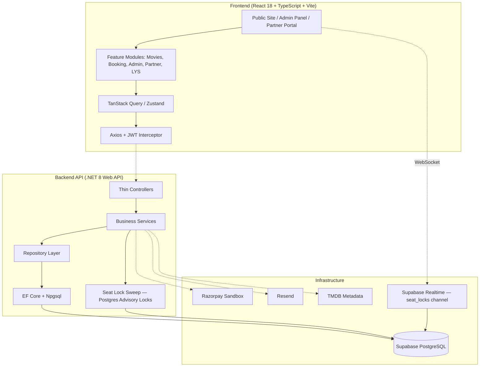

# 🎬🎟️ BookKaroo — Entertainment Ticket Booking Platform

[](docs/STATUS.md)
[](frontend)
[](backend)
[](backend/database/migrations)

**BookKaroo** is a BookMyShow-style ticket booking platform for the Indian market — movies, live events, plays, sports (including IPL), comedy shows, and activities across 25 seed cities. It ships an end-user booking flow, an admin panel, and a partner/venue portal with an event-submission workflow (LYS).

---

## 🏗️ Architecture Overview

Built as a **Controller → Service → Repository** layered API behind a feature-based React SPA, with Postgres advisory locks (not Redis) handling seat concurrency and Supabase Realtime pushing live seat state to every connected client.



### Key Design Decisions
- **No foreign keys** — referential integrity enforced at the service layer; every table carries a UUID PK + indexed reference columns.
- **Soft delete only** — every table has `created_at` / `updated_at` / `deleted_at`; EF Core global query filters hide deleted rows automatically.
- **Seat locking without Redis** — `seat_locks` table + Postgres advisory locks, with a 60s cron sweep to release stale locks.
- **Idempotent payments** — payment endpoints require an `Idempotency-Key` header.
- **Audit log** on all admin mutations.

---

## ✨ Key Highlights

- **Seat selection with live concurrency** — Postgres advisory locks + Supabase Realtime broadcast so two users never double-book the same seat.
- **GST-compliant invoicing** — QuestPDF-generated invoice attached to booking confirmation emails, with CGST/SGST/IGST breakdown.
- **JWT + BCrypt auth** — short-lived access tokens, httpOnly refresh tokens, rate-limited auth endpoints.
- **Admin panel** — dashboard KPIs, movies/events/venues/shows CRUD, booking & user management, reports.
- **Partner portal + LYS (List Your Show)** — venue partners manage their own shows/bookings; organizers submit events for admin review with a request-changes workflow.
- **AI chatbot** — Groq-powered assistant for show discovery and booking help.

---

## 🛠️ Technology Stack

| Layer | Technologies Used |
| :--- | :--- |
| **Frontend** | React 18, TypeScript, Vite, Tailwind CSS, shadcn/ui, TanStack Query, Zustand, React Router v6, react-hook-form + zod, framer-motion |
| **Backend** | .NET 8 Web API, C#, EF Core 8 + Npgsql, FluentValidation, Serilog |
| **Database** | PostgreSQL (Supabase-hosted), no ORM-managed foreign keys |
| **Realtime** | Supabase Realtime (WebSockets) |
| **Authentication** | JWT (HS256), BCrypt (cost 12) |
| **Payments** | Razorpay (sandbox) |
| **Email** | Resend |
| **Movie Metadata** | TMDB API |
| **AI Chatbot** | Groq (Llama 3.3 70B) |
| **Testing** | xUnit + Moq + FluentAssertions (backend) |

---

## 📁 Repository Directory Structure

```text
BookKaroo/
├── .claude/            # Claude Code configs, rules, and slash commands
├── docs/                # PRD, architecture, schema, API contracts, design system, status
├── frontend/            # React + TypeScript SPA
│   └── src/features/    # Feature-based modules (movies, booking, admin, partner, lys, ...)
├── backend/              # .NET 8 Web API
│   └── src/
│       ├── BookKaroo.Api/             # Controllers, Program.cs, middleware
│       ├── BookKaroo.Application/     # Services, DTOs, validators
│       ├── BookKaroo.Domain/          # Entities, enums
│       └── BookKaroo.Infrastructure/  # Repositories, DbContext, external services
│   └── database/migrations/         # Numbered SQL migrations + seed scripts
├── CLAUDE.md             # Project context for Claude Code
└── README.md
```

---

## 🚀 Getting Started

### Prerequisites

**Required**
- [.NET 8 SDK](https://dotnet.microsoft.com/download/dotnet/8.0)
- [Node.js 20+](https://nodejs.org/) & npm
- A [Supabase](https://supabase.com) project (free tier works) — provides `DATABASE_URL`

**Optional** — each unlocks one feature; the app runs without them and degrades gracefully:

| Service | Env var | Without it |
|---|---|---|
| [Groq](https://console.groq.com) | `GROQ_API_KEY` | AI chatbot replies with a canned fallback message |
| [Resend](https://resend.com) | `RESEND_API_KEY` | Emails are skipped (logged, not sent) — booking still succeeds |
| [Razorpay](https://razorpay.com) sandbox | `RAZORPAY_KEY_ID` / `RAZORPAY_KEY_SECRET` | Payments run through the built-in mock provider (`PAYMENT_PROVIDER=mock`, the default) |
| [TMDB](https://www.themoviedb.org/settings/api) | `TMDB_BEARER` | Admin movie-metadata/poster sync is unavailable |

### 1. Clone
```bash
git clone https://github.com/prakashinfotech/BookKaroo.git
cd BookKaroo
```

### 2. Backend Setup
```bash
cd backend

# Copy the secret templates and fill in your own real values — never commit the filled-in files
cp src/BookKaroo.Api/Properties/launchSettings.json.example src/BookKaroo.Api/Properties/launchSettings.json
cp src/BookKaroo.Api/appsettings.Production.json.example src/BookKaroo.Api/appsettings.Production.json

dotnet restore

cd src/BookKaroo.Api
dotnet ef database update --project ../BookKaroo.Infrastructure
dotnet run   # → http://localhost:5000
```

### 3. Frontend Setup (new terminal)
```bash
cd frontend
cp .env.example .env   # fill in your own keys

npm install
npm run dev   # → http://localhost:5173
```

### Environment Variables
Every secret-bearing file has a matching `.example` template — `backend/src/BookKaroo.Api/Properties/launchSettings.json.example`, `backend/src/BookKaroo.Api/appsettings.Production.json.example`, and `frontend/.env.example`. **Only the `.example` files are committed; the real, filled-in files are gitignored and must never be pushed.** Full variable reference: [docs/ARCHITECTURE.md](docs/ARCHITECTURE.md) § 9.

---

## 🧪 Testing

### Backend
```bash
cd backend
dotnet test BookKaroo.sln
```

### Frontend
```bash
cd frontend
npm run typecheck   # tsc --noEmit — must pass before committing
```
Frontend unit/component testing (Vitest + React Testing Library) is planned but not yet wired up — see [docs/STATUS.md](docs/STATUS.md).

---

## 🔀 Development Workflow
See [docs/GIT-WORKFLOW.md](docs/GIT-WORKFLOW.md). TL;DR:
```bash
git checkout master && git pull
git checkout -b feat/<scope>
# work, commit (conventional commits), push
# open PR into master
```

---

## 📚 Documentation

| Doc | Purpose |
|---|---|
| [PRD.md](docs/PRD.md) | Product requirements |
| [ARCHITECTURE.md](docs/ARCHITECTURE.md) | System design, diagrams, deployment, full env var reference |
| [DATABASE.md](docs/DATABASE.md) | Schema + ERD + indexes |
| [API.md](docs/API.md) | REST endpoint contracts |
| [DESIGN-SYSTEM.md](docs/DESIGN-SYSTEM.md) | Colors, typography, components |
| [GIT-WORKFLOW.md](docs/GIT-WORKFLOW.md) | Branching strategy |
| [STATUS.md](docs/STATUS.md) | Live tracker of what's built, partial, or pending |
| [TESTING.md](docs/TESTING.md) | Test strategy and current coverage |
| [DEPLOYMENT.md](docs/DEPLOYMENT.md) | Vercel + Render deployment guide |

---

## 🔐 Local Dev Accounts
The seed migrations in [`backend/database/migrations/`](backend/database/migrations/) create local test data once you run them against your own Supabase project. No usable credentials are published in this repo — create your own local accounts by signing up through the app.

---

## 📄 Repository Use
This repository is maintained by Prakash Infotech as a project showcase. Add an approved LICENSE file before distributing or reusing the source under a public software license.
