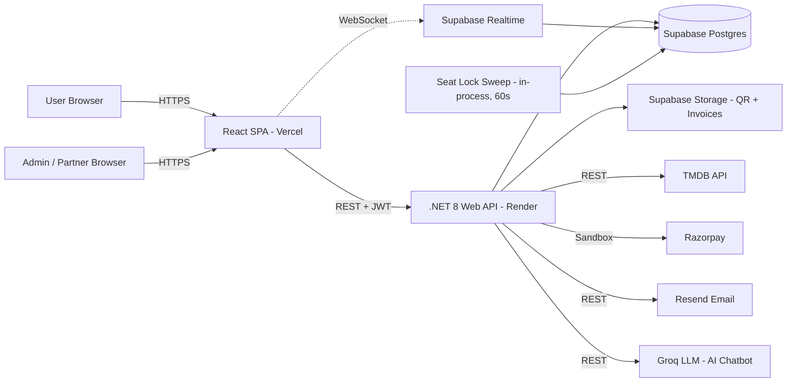

# BookKaroo — Architecture

## 1. System Overview



---

## 2. Layered Architecture

### Backend (.NET 8)

```
BookKaroo.Api            ← HTTP layer (controllers, middleware, background services)
   │
BookKaroo.Application    ← Business logic (services, DTOs, validators, interfaces)
   │
BookKaroo.Domain         ← Pure entities, enums (zero dependencies)
   │
BookKaroo.Infrastructure ← EF Core, repositories, external APIs (Resend, TMDB, Razorpay, Groq)
```

Major controller groups: Auth, Users, Movies, Events, Shows, SeatLocks, Bookings, Payments, Cities, Search, Help, Home, Chatbot, and the **Admin**, **Partner**, and **Lys** (List-Your-Show organizer self-serve) areas, each with their own controller set for their respective portal. Full endpoint reference: [docs/API.md](API.md).

### Frontend (React 18)

```
src/
├── app/        ← Router, providers, error boundary
├── features/   ← Feature-first modules: auth, movies, booking, events, admin, partner, lys, chatbot, ...
├── shared/     ← Reusable components, hooks, lib, stores, types, constants
└── design/     ← Legacy design-system prototype (tokens/screens) — not wired into the live app; only ThemeContext is used
```

Full structure: [docs/FRONTEND.md](FRONTEND.md)

---

## 3. Three Portals, One API

BookKaroo isn't just an end-user booking site — it's three route-guarded SPAs sharing one codebase and one backend:

| Portal | Route guard | Who | What |
|---|---|---|---|
| Public site | `ProtectedRoute` (booking only) | End users | Discover, book, pay, manage bookings |
| Admin panel | `AdminRoute` | BookKaroo staff | CRUD on all content, bookings, users, reports, reviewing LYS submissions |
| Partner portal | `PartnerRoute` | Venue partners | Manage their own venues/shows/bookings, submit LYS events |
| LYS (List Your Show) | `LysRoute` | Independent organizers | Self-serve event submission with admin review + request-changes workflow |

---

## 4. Payment Provider Abstraction

```csharp
// BookKaroo.Application/Interfaces/IPaymentProvider.cs
public interface IPaymentProvider
{
    string ProviderName { get; }
    Task<PaymentOrder> CreateOrderAsync(CreateOrderRequest req, CancellationToken ct);
    Task<PaymentCapture> CaptureAsync(string providerOrderId, CancellationToken ct);
    Task<RefundResult> RefundAsync(string providerPaymentId, decimal amount, CancellationToken ct);
}
```

| Class | Location | Status |
|-------|----------|-------|
| `MockPaymentProvider` | `BookKaroo.Infrastructure/Payment/` | Implemented — default for local dev |
| `RazorpayPaymentProvider` | `BookKaroo.Infrastructure/Payment/` | Implemented — sandbox |

Selected via `PAYMENT_PROVIDER` env var (`mock` | `razorpay`). Swapping providers requires no controller/service code changes.

**Production Safety:**
```csharp
// BookKaroo.Infrastructure/Payment/MockPaymentProvider.cs
public MockPaymentProvider(IHostEnvironment env)
{
    if (env.IsProduction())
        throw new InvalidOperationException("MockPaymentProvider must not be used in Production.");
}
```

---

## 5. Request Flow Examples

### A. Seat Selection (Real-Time)

```
User opens seat selection page
  → GET /api/shows/{showId}/seats  (initial locked/booked state)
  → Subscribe to Supabase channel "show:{showId}"

User clicks a seat
  → POST /api/seat-locks { showId, seatId }
  → Service: pg_try_advisory_lock(hash(showId, seatId))
  → INSERT seat_locks row (expires_at = now() + 8min)
  → Supabase Realtime broadcasts INSERT event to channel "show:{showId}"
  → All subscribers update their seat grid optimistically

Countdown reaches 0 / user abandons
  → Cron sweep (60s): DELETE WHERE expires_at < now()
  → pg_advisory_unlock(lockKey)
  → Supabase Realtime broadcasts DELETE event
```

### B. Payment Flow (Mock)

```
User clicks "Proceed to Pay"
  → POST /api/payments/order (Idempotency-Key: {uuid})
  → MockPaymentProvider.CreateOrderAsync → returns synthetic orderId
  → Return { orderId, providerOrderId, amount, breakdown }

  Frontend shows mock checkout dialog:
    [Simulate Success]  [Simulate Failure]

  On Simulate Success:
    → POST /api/payments/mock-capture { providerOrderId }
    → BookingService (inside DB transaction):
          DELETE seat_locks WHERE user_id = ? AND show_id = ?
          INSERT bookings (booking_ref, status=Confirmed, GST fields, ...)
          INSERT booking_seats (one per selected seat)
          UPDATE payments SET status = 'captured', captured_at = now()
          COMMIT
    → Fire-and-forget tasks:
          Generate QR code → upload to Supabase Storage
          Generate GST invoice PDF → upload to Supabase Storage
          Send confirmation email via Resend (with invoice attached)
    → Return { booking, invoiceUrl, qrUrl }
```

### C. Razorpay (Same Flow, Real Provider)

Same controller/service code — `IPaymentProvider` resolves to `RazorpayPaymentProvider` when `PAYMENT_PROVIDER=razorpay`. Real checkout modal loads in browser via the Razorpay SDK. Server-side webhook verification (`POST /api/payments/verify`) exists; a dedicated inbound `/api/payments/webhook` receiver is not yet implemented.

---

## 6. Authentication Flow

```
Signup / Login
  → POST /auth/signup or /auth/login
  → BCrypt.Verify (cost 12) + generate JWT pair
  → Access token (in response body)
  → Refresh token (httpOnly cookie)

Protected request
  → Bearer {accessToken} in Authorization header
  → JWT middleware validates signature + expiry
  → On 401: client calls POST /auth/refresh (uses httpOnly cookie)
  → New access token issued

Admin / Partner request
  → Same JWT, but "role": "admin" | "partner" claim
  → Role-based route guards + backend authorization checks validate the claim
  → Rate limit on /auth/* : 10 req/min/IP
```

---

## 7. Seat Lock State Machine

```
Seat State:
  AVAILABLE → (user clicks) → LOCKED (by this user, 8min timer)
  AVAILABLE → (other user locks) → LOCKED_BY_OTHER (red/amber on grid)
  LOCKED → (payment captured) → BOOKED (permanent)
  LOCKED → (timer expires or manual release) → AVAILABLE
  LOCKED_BY_OTHER → (their timer expires) → AVAILABLE

Advisory lock key = hash(showId + seatId) → 64-bit long
PostgreSQL handles mutual exclusion at DB level.
```

---

## 8. GST Flow

```
Checkout
  → PricingService.Calculate(ticketPrice, qty, customerStateCode, hasCoupon)
  → company_state_code = "24" (Gujarat, from admin settings)
  → if customerStateCode == "24": CGST 9% + SGST 9% on (convenienceFee + offerFee)
  → else:                          IGST 18% on (convenienceFee + offerFee)
  → Ticket price itself NOT taxed (venue revenue, not BookKaroo revenue)

Invoice
  → QuestPDF generates GST-compliant PDF
  → Includes: company_gstin, customer_state, SAC codes, tax breakdown
  → Uploaded to Supabase Storage (invoices/ bucket — private)
  → Pre-signed URL returned in booking confirmation
```

---

## 9. Caching Strategy

- **TanStack Query** (frontend): `staleTime` 5min for movies/events, 0 for seats/locks
- **No server-side cache** — Supabase Postgres is fast enough at current scale
- **Idempotency cache**: `idempotency_cache` table, 24h TTL, on payment endpoints

---

## 10. Logging & Observability

- **Serilog** structured logs on backend (console + rolling file)
- Log levels: `Information` for normal ops, `Warning` for retries, `Error` for unhandled exceptions
- Frontend: `console.error` in ErrorBoundary; no external error-tracking service wired up yet

---

## 11. Deployment Topology

```
Frontend (Vercel)   ← static + edge CDN
   ↓ HTTPS
Backend (Render)    ← single .NET 8 Web API service, Docker
   ↓
Database (Supabase) ← managed Postgres + Realtime + Storage
   ↓
Cron (built-in background service, runs inside the .NET process)
```

Deployment guide: [docs/DEPLOYMENT.md](DEPLOYMENT.md)

---

## 12. Environment Configuration

Full variable reference and setup instructions: [docs/DEPLOYMENT.md](DEPLOYMENT.md) and `backend/.env.example` / `backend/src/BookKaroo.Api/Properties/launchSettings.json.example`.

Key variable groups:
- Database — `DATABASE_URL` (Supabase Postgres connection string)
- Supabase — `SUPABASE_URL`, `SUPABASE_ANON_KEY`, `SUPABASE_SERVICE_ROLE_KEY`, storage bucket names
- Auth — `JWT_SECRET`, `JWT_ISSUER`, `JWT_AUDIENCE`, access/refresh TTLs
- Payments — `PAYMENT_PROVIDER` (`mock` | `razorpay`), `RAZORPAY_KEY_ID`, `RAZORPAY_KEY_SECRET`
- Email — `RESEND_API_KEY`, `RESEND_FROM`
- Metadata — `TMDB_API_KEY`, `TMDB_BEARER`
- AI chatbot — `GROQ_API_KEY`, `GROQ_MODEL`, `CHATBOT_ENABLED`
- CORS — `CORS_ALLOWED_ORIGINS`

**Never commit real values for any of the above** — only `.example` templates belong in git.

---

## 13. Risk Register

| Risk | Mitigation |
|------|-----------|
| MockPaymentProvider in production | Constructor guard throws if `env.IsProduction()` |
| Seat double-booking | pg_try_advisory_lock + DB transaction on capture |
| GST calculation errors | Unit tests for intra/inter-state combinations |
| Orphan rows (no FKs) | Service-layer cleanup on soft delete |
| Context loss between Claude sessions | `docs/HANDOFF.md` generated on demand via `/handoff` |

---

## 14. Scalability Path (Future)

- Add read replicas for reporting queries
- CDN for TMDB poster caching
- Horizontal scaling of .NET service (stateless JWT, no session)
- Background job queue for invoice/email (currently fire-and-forget tasks)
- Separate admin API service if admin/partner panels grow significantly
